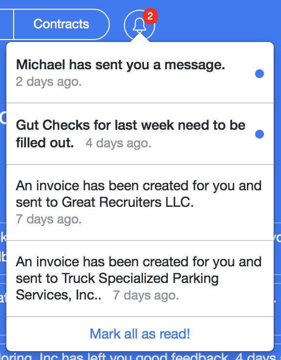

NotifyOn
==========


NotifyOn generates automatic notifications as a result of state changes on a
particular model in a Rails application. It supports email messages, along with
third-party real-time delivery (via [Pusher](https://pusher.com)), while also storing each notification in your
database so you can use, adjust, and display as you'd wish.

Documentation can be found in [the wiki
library](https://github.com/digerata/NotifyOn/wiki). A good place to start is further down this page.

If you have questions, comments, ideas, or bug reports, please [create an
issue](https://github.com/BrilliantChemistry/NotifyOn/issues/new).

Contributors
----------

This project was built and is maintained by [Mike
Wille](https://github.com/digerata) and [Sean C
Davis](https://github.com/seancdavis), and was made possible by [Brilliant
Chemistry](http://www.brilliantchemistry.com/).

License
----------

See [MIT-LICENSE](https://github.com/BrilliantChemistry/NotifyOn/blob/master/MIT-LICENSE)


## Install Notify:

To install NotifyOn, add it to your Gemfile:

```ruby
gem 'notify_on'
```

Then run the bundle command to install it.

```text
$ bundle exec rails g notify_on:install
```

This adds the following to your project:

- Migration to create the `notify_on_notifications` table
- Default NotifyOn config
- Bulk notification settings

Migrate your database and then you're ready to go.

There are two ways in which you can configure a notification:

1. [Within A Model](https://github.com/BrilliantChemistry/NotifyOn/wiki/notify_on)
2. [Bulk Configuration](https://github.com/BrilliantChemistry/NotifyOn/wiki/Bulk-Configuration)

Option 1 is the way to go when starting out. If you find that your configuration gets complicated within the model, you can move it out to option 2.

Check out the pages above to learn more about each method. Note that it is recommended you read through the model config first, as it outlines the options for a notification that may be used in bulk.

*We'll go through an example implementation below...*

## Configure Model

Set what model is receiving notifications (E.g., the user...)

`user.rb`

```ruby
class User < ApplicationRecord

  receives_notifications

end
```

Add to your model the `notify_on` config:

`chat.rb`

```ruby
notify_on :create, { to: :other_users, message: ‘{sender.first_name} sent you a message.’, email: { template: 'new_message’ } }

def other_users
	chat.other_users(author)
end
```

See docs on [notify_on](https://github.com/BrilliantChemistry/NotifyOn/wiki/notify_on) for further details.

## Provide better email messages

Add your corresponding mailer view:
(See: https://github.com/BrilliantChemistry/NotifyOn/wiki/Override-Default-Email-Message)

`app/views/notifications/new_message.html.erb`

(Notice the partials for a shared header and footer. The model object that triggered the notification is passed in as @trigger.)
```erb
<% @message = @trigger %>
<%= render partial: "shared/mail/header" %>

<span class="preheader">
	<%= truncate(@message.content.gsub(/[\n]+/, " "), length: 200) %>
</span>
<div style="color: #999;">-- Write ABOVE THIS LINE to post a reply or
	<%= link_to “view this on [Your Site].”, chats_url(@message.chat) %> --
</div>
<div style="margin:0; padding:0; width:100%; line-height: 100% !important; background-color: #fff; margin-top: 15px;">

<p style="font-size: 14px">
	<%= render partial: "shared/avatar", locals: {user: @sender, :size => :small} %>
	<% if @message.chat.messages.count > 1 %>
		<%= @sender.first_name %>
		has replied:
	<% else %>
		<%= @sender.full_name %>
		has sent you a message:
	<% end %>
</p>
<p></p>
<%= markdown @message.filtered_content %>
<hr>

<p style="font-size: 12px; color: #999">
	There may be more messages sent since this one. Log in to [Your Site] with your account, '<%= @recipient.email %>'
	to view them all. <%= link_to "Go there now.", chats_url(@message.chat) %>
</p>

<%= render partial: "shared/mail/footer" %>
```

## Configuring In App Notifications

Lastly, configure pusher.io so that if a user is logged in, they'll get a push notification in the browser instead of an email.

Verify settings in `config/intializers/notify_on.rb`:

```ruby
# Pusher enables you to send notifications in real-time. Learn more about
# Pusher at https://pusher.com. If you are going to use Pusher, you need to
# include the following values:
#
# config.pusher_app_id = 'my_app_id'
# config.pusher_key = 'my_key'
# config.pusher_secret = 'my_secret'
#
# Note: You may want to use environment-dependent values, not tracked by git,
# so your secrets are not exposed. You may choose to use Rails' secrets for
# this. For example:
#
config.pusher_app_id = Rails.application.secrets.pusher_app_id
config.pusher_key = Rails.application.secrets.pusher_key
config.pusher_secret = Rails.application.secrets.pusher_secret
#
# While you can configure your Pusher event in each "notify_on" call, you can
# also set your default configuration so you don't have to restate it for
# every notification.
#
config.default_pusher_channel = 'presence-{:env}-notification-{:recipient_id}'
config.default_pusher_event = 'new_notification'
#
# You can use Pusher by default (which requires the channel and event be set
# above). Uncomment the following setting to do so.
#
config.use_pusher_by_default = true
```

*Setup Your UI (Notification List)*

This part is very application specific.

BC has a menu icon that displays the number of unread notifications. Clicking or tapping on that shows a dropdown of the past X notifications, both read and unread.



Again this is very UI specific, but here is code and instructions to help.

1. Communicate to the UI what channel to listen to for notifications.

```erb
<body data-notifications="<%= "presence-#{Rails.env.to_s.downcase}-notification-#{current_user.id}" if user_signed_in? %>"
```

2. Setup notifications if we are logged in:

```erb
<% if user_signed_in? %>
	<script>
		$(document).on('ready', function(){
			if(window.usePusher == true) {
				initRealTimeNotifications();
			}
		});
	</script>
<% end %>
```

3. Setup your Notification UI

This code will listen for new notifications (of type `new_notification` ;) ) from pusher. When it receives one, it will go back to the server
for the new dropdown menu list. It will also update the number of notifications shown in the red circle. (And display it if there were 0 unread before)

`notifications.js.erb`

```javascript
function initRealTimeNotifications() {
	if(notifications.pusher == null) {
		notifications.pusher = new Pusher('<%= Rails.application.secrets.pusher_key %>', {
			encrypted: true
		});

		notifications.channelName = $('body').data('notifications');

		notifications.channel = notifications.pusher.subscribe(notifications.channelName);
		notifications.channel.bind('new_notification', function(data) {

			// In case we've logged out since binding this event
			if($('body').data('notifications') == notifications.channelName) {

				// Update the reference to the list
				// (This is the contents of the dropdown and you must provide an endpoint to render this.)
				$.get('/notifications', function(notifications){
					$('#notifications-list-ref').html(notifications);

					var focusedOnChat = false;

					// If we are currently on
					if (window.location.pathname == data.link) {
						focusedOnChat = true;
					} else if ($('#chat-window').length > 0) {
						var urlSegments = data.link.split('/'),
								id = parseInt(urlSegments[urlSegments.length - 1]),
								currentId = parseInt($('#chat-window').attr('data-chat'));
						focusedOnChat = (currentId == id);
					}

					// If user is already on the right page, we're not going to animate the
					// notification.
					if(focusedOnChat && data.is_chat) {
						// Hit the notification's link so it can be marked as read.
						$.get(data.link);
						// Remove the unread icon.
						$('.notification-list li > a > span.unread').first().remove();
					} else {
						// Update our unread notifications count
						if($('#alert-icon').find('.notifications-flag').length == 0) {
							$('#alert-icon').prepend('<span class="notifications-flag"></span>');
						}
						var unread = $('#notifications-list').attr('data-unread')
						$('#alert-icon').find('.notifications-flag').text(unread);

						// Play the notification sound unless user is connected to a chat
						// channel
						if(chat.subscribedToChannel == null || data.data.is_chat != true) {
							$('#notification-sound')[0].play();
						}
					}
				});
			}
		});
	}
}
```

4. Setup a Notification Controller

This handles three things (three routes):

1. Rendering the dropdown menu of notifications. 
2. Handle redirecting someone who views a notification. At the same time, marking the notification as read when viewing it.
3. Marking all notifications as unread.

```ruby
class NotificationsController < ApplicationController

	def index
		if request.xhr?
			render :layout => false
		else
			redirect_to dashboard_path
		end
	end

	def show
		if current_user.notifications.find_by_id(params[:id]).nil?
			not_found
		else
			@notification = current_user.notifications.find_by_id(params[:id])
			@notification.read!
			if @notification.trigger.nil?
				@notification.destroy
				redirect_to root_path, :alert => 'Could not locate notification link.'
			else
				redirect_to @notification.link, :only_path => true
			end
		end
	end

	def markread
		current_user.notifications.unread.each { |notification| notification.read! }
		redirect_to request.referrer || root_path
	end

end
```

Set your routes:

```ruby
	get 'notifications/markread', :as => 'markread_notifications'
	get '/notifications' => "notifications#index", :as => :notifications
	get '/notifications/:id' => "notifications#show", :as => :notification

```

View for rendering list of notifications in menu:

`views/notifications/index.html`

```erb
<div id="notifications-list" data-unread="<%= current_user.notifications.unread.count %>">
	<%= render 'list' %>
</div>
```

`views/notifications/_list.html`
```erb
<ul class='notification-list'>
	<% if current_user %>
		<%= content_tag(:li, 'No Notifications') unless has_notifications? %>

		<% recent_notifications.each do |n| %>
			<li class="<%= 'unread' if n.unread? %>">
				<%= link_to(notification_path(n)) do %>
					<%= content_tag(:span, '', :class => 'icon unread') if n.unread? %>
					<% if n.sender.present? && n.sender.avatar.present? %>
						<%= render partial: "shared/avatar",
											 locals: { user: n.sender, size: "small" } %>
					<% end %>

					<span class='description'><%= n.description %></span>
					&nbsp;
					<span class='when'><%= time_ago_in_words n.created_at %> ago.</span>
				<% end %>
			</li>
		<% end %>

		<% if unread_notifications.present? %>
			<li class='mark-as-read-button'>
				<a href='<%= markread_notifications_path %>' method='post'>
					Mark all as read!
				</a>
			</li>
		<% end %>

	<% end %>
</ul>
```

(There is an assumption here about having an `avatar` property for the user's image.)

*Setup Your UI (Single Red Dot)*

This part is very application specific.

If you are not displaying a list of past notifications, but maybe focusing just on one type of notification, say chat. You can place a red span with the number of unread chats inside of it.

Again this is very UI specific, but here is code and instructions to help.

1. Communicate to the UI what channel to listen to for notifications.

```erb
<body data-notifications="<%= "presence-#{Rails.env.to_s.downcase}-notification-#{current_user.id}" if user_signed_in? %>"
```

2. Setup notifications if we are logged in:

```erb
<% if user_signed_in? %>
	<script>
		$(document).on('ready', function(){
			if(window.usePusher == true) {
				initRealTimeNotifications();
			}
		});
	</script>
<% end %>
```

3. Setup your Notification UI

This code will listen for new notifications (of type `new_notification` ;) ) from pusher. When it receives one, it will go back to the server
for the new dropdown menu list. It will also update the number of notifications shown in the red circle. (And display it if there were 0 unread before)

`notifications.js.erb`

```javascript
function initRealTimeNotifications() {
	if(notifications.pusher == null) {
		notifications.pusher = new Pusher('<%= Rails.application.secrets.pusher_key %>', {
			encrypted: true
		});

		notifications.channelName = $('body').data('notifications');

		notifications.channel = notifications.pusher.subscribe(notifications.channelName);
		notifications.channel.bind('new_notification', function(data) {

			// In case we've logged out since binding this event
			if($('body').data('notifications') == notifications.channelName) {

				var focusedAlready = false;

				// If we are currently on the notification's object's page, don't show the UI
				if (window.location.pathname == data.link) {
					focusedAlready = true;
				} else if ($('#chat-window').length > 0) {
					var urlSegments = data.link.split('/'),
							id = parseInt(urlSegments[urlSegments.length - 1]),
							currentId = parseInt($('#chat-window').attr('data-chat'));
					focusedAlready = (currentId == id);
				}

				// If user is already on the right page, we're not going to display the
				// notification.
				if(focusedAlready && data.is_chat) {
					
				} else {
					// Update our unread notifications count
					if($('#alert-icon').find('.notifications-flag').length == 0) {
						$('#alert-icon').prepend('<span class="notifications-flag"></span>');
					}
					$('#alert-icon').find('.notifications-flag').html("&bul;");

					// Play the notification sound unless user is connected to a chat
					// channel
					if(chat.subscribedToChannel == null || data.data.is_chat != true) {
						$('#notification-sound')[0].play();
					}
				}
				
			}
		});
	}
}
```


